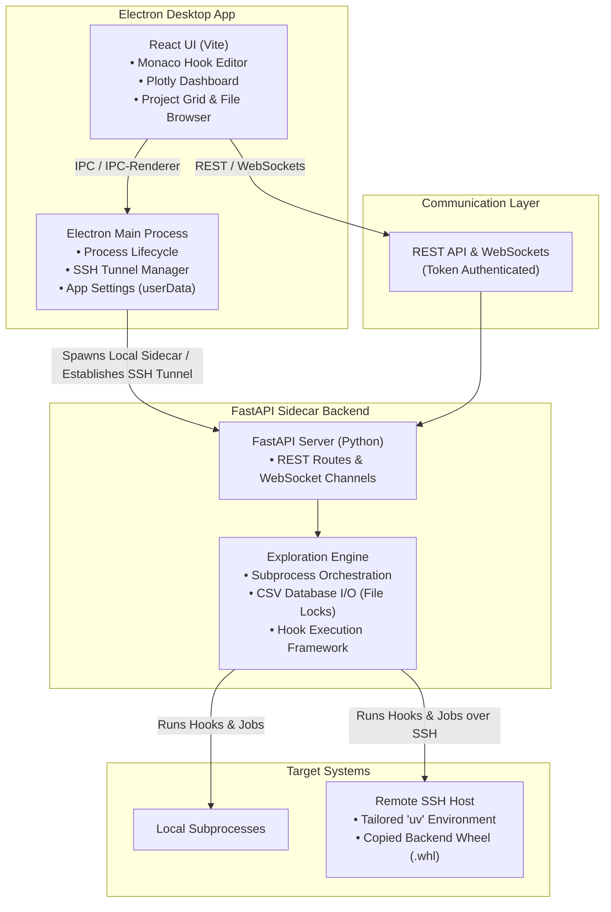
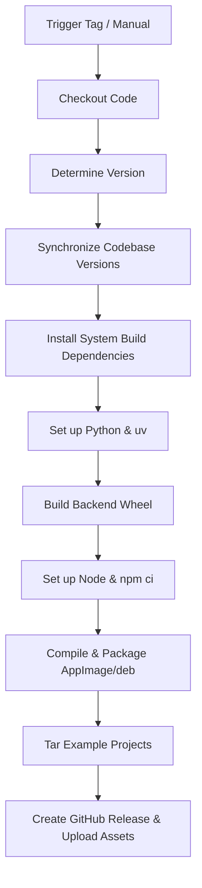

# 🚀 zX: Parametric Exploration Desktop Application

[](LICENSE)
[](https://github.com/zenotech/zX/actions/workflows/build-linux.yml)

**zX** is a high-performance, local-first cross-platform desktop application designed for the parametric exploration of CLI applications over both local and remote SSH environments. By decoupling high-speed presentation from core computation, **zX** provides a premium, responsive IDE-like interface for managing complex engineering workflows, running iterative optimization tasks, and visualizing structured outcomes.

---

## 🏛️ System Architecture

**zX** implements a clean separation of concerns using a **Client-Sidecar** architectural pattern:

*   **Frontend (Electron + React + Vite):** Pure presentation layer. Includes dynamic data grids, a Monaco-based hook editor with inline syntax verification, interactive Plotly visualization dashboards, a split-view terminal emulator (`xterm.js`), and a VS Code-style file browser.
*   **Backend (FastAPI Sidecar):** Robust Python server packaged as a wheel. Handles SSH config parsing (`~/.ssh/config`), token-based secure API endpoints, background execution queues, thread/subprocess orchestration, and sequential/iterative parametric loops.
*   **Communication:** Secured locally or via SSH tunnels using token-based authentication over high-speed REST endpoints and real-time WebSockets.



---

## 🛠️ Development Workflow

The local development lifecycle is managed via the helper script [develop.sh](file:///Users/jamil.appa/Documents/zX/develop.sh). This script automates bootstrapping Python virtual environments, resolving Node dependencies, compiling the FastAPI backend wheel, and launching hot-reloaded development processes.

### Running the Development Environment

Simply run the following script from the root of the repository:

```bash
./develop.sh
```

### What `develop.sh` Does Under the Hood:

1.  **Node Dependency Verification:** Checks if `node_modules` exists. If not, runs `npm install` automatically to fetch frontend and packaging packages.
2.  **Python Virtual Environment Setup:** Detects and verifies the local virtual environment folder (`.venv`). If found, it activates the environment to ensure Python dependencies (`fastapi`, `uvicorn`, `pandas`, `paramiko`, etc.) are in scope.
3.  **Port Allocation Safety:** Scans for active processes listening on port `8000` (the default FastAPI sidecar port). If a stray backend process is detected, it is gracefully or forcibly terminated (`kill -9`) to prevent binding collision.
4.  **Stale Build Cleanup:** Removes old compilation targets and distribution assets:
    ```bash
    rm -rf dist-electron dist
    ```
5.  **FastAPI Backend Package Build:** Navigates to the `backend/` directory and compiles the Python FastAPI sidecar into a wheel package (`.whl`).
    *   *Prefers:* `uv build --wheel` for lightning-fast compilation.
    *   *Fallback:* Installs standard `build` via `pip` and compiles with `python3 -m build --wheel`.
6.  **Concurrent Dev Server Launch:** Starts both the Vite development server (with hot-reloading) and the Electron dev shell concurrently:
    ```bash
    npm run dev:all
    ```
    This script runs `concurrently -k "npm run dev" "npm run electron:dev"`, ensuring that stopping the terminal cancels both services cleanly.

---

## 📦 Packaging Workflow

To compile and package the desktop application locally for production use, the repository provides the [package.sh](file:///Users/jamil.appa/Documents/zX/package.sh) script.

### Running the Packager

Execute the production packager script:

```bash
./package.sh
```

### What `package.sh` Does Under the Hood:

1.  **Code Signing Configuration:** Automatically sets up system environment variables to support Apple macOS signing and notarization:
    *   `APPLE_ID`: `jamil.appa@zenotech.com`
    *   `APPLE_TEAM_ID`: `HDDG45ZM4G`
    *   `APPLE_APP_SPECIFIC_PASSWORD`: uedy-sedx-xfji-hslx
    *   `DEBUG` & `DEBUG_DMG` flags are activated to provide deep diagnostics from `electron-builder`, `electron-osx-sign`, and `electron-notarize`.
2.  **Node Modules Check:** Verifies that all dependencies are installed, running `npm install` if required.
3.  **Clean Stale Outputs:** Wipes previous packaging artifacts to guarantee a clean build state:
    ```bash
    rm -rf dist dist-electron release
    ```
4.  **Backend Distributable Compiling:** Activates the Python `.venv` and packages the current FastAPI source code into a wheel package. This wheel is copied inside the Electron package resources, allowing Electron to deploy it on remote servers automatically.
5.  **Application Packaging:** Runs the packaging sequence:
    ```bash
    npm run package
    ```
    This scripts invokes:
    *   `electron:build` to compile main process TypeScript files (`tsconfig.electron.json`) to `dist-electron`.
    *   `build:renderer` to check TypeScript files in the frontend and build optimized production chunks via Vite into `dist`.
    *   `electron-builder` to bundle the app, sign binary packages, and generate native installers inside the `release` directory.

---

## 🐙 GitHub Actions Workflow

The continuous integration and delivery system is configured via [build-linux.yml](file:///Users/jamil.appa/Documents/zX/.github/workflows/build-linux.yml) inside `.github/workflows/`.

This automated workflow compiles and packages **zX** for Linux platforms (AppImage and debian packages) and registers a new GitHub Release.

### Workflow Triggers

The pipeline runs under two conditions:
1.  **Tag Pushes:** When a git tag matching the pattern `v*` (e.g. `v0.2.0`, `v1.0.0-beta.1`) is pushed.
2.  **Manual Trigger (`workflow_dispatch`):** Allows maintainers to trigger builds manually via the GitHub Actions dashboard. It takes a version input parameter (defaults to `0.2.0`).

### Execution Pipeline Steps



1.  **Checkout Repository:** Pulls the source code using `actions/checkout@v6`.
2.  **Determine Version:** Reads the target version from either the `workflow_dispatch` text input or the git tag (stripping the `v` prefix). Saves it as a `VERSION` environment variable.
3.  **Synchronize Codebase Versions:** Automates consistency by rewriting versions across the entire stack:
    *   **Node:** Updates `package.json` & `package-lock.json` using `npm version`.
    *   **Backend config:** Rewrites the `version` field in [pyproject.toml](file:///Users/jamil.appa/Documents/zX/backend/pyproject.toml).
    *   **Backend entrypoint:** Updates `__version__` in [__init__.py](file:///Users/jamil.appa/Documents/zX/backend/zx_backend/__init__.py).
    *   **Frontend UI:** Replaces references to the zX Engine version displayed in the React interface ([App.tsx](file:///Users/jamil.appa/Documents/zX/src/renderer/App.tsx)).
    *   **Main Process:** Adjusts the wheel package name pattern queried during remote bootstrap inside [main.ts](file:///Users/jamil.appa/Documents/zX/src/main.ts).
4.  **Install System Build Dependencies:** Installs Linux system libraries (`libgl1`, `libegl1`, `libxrender1`, `libxt6`, `libxxf86vm1`, and `build-essential`) needed for headless graphic bindings during Vite builds and Electron packaging.
5.  **Set Up Python Environment:** Provisions Python `3.14` and installs the `astral-sh/setup-uv@v8.1.0` action.
6.  **Build Python Backend Wheel:** Navigates to the backend directory and builds the wheel package:
    ```bash
    uv build --wheel
    ```
7.  **Set Up Node Environment:** Installs Node.js `24`.
8.  **Install Node Dependencies:** Uses `npm ci` (clean install) for quick, deterministic dependency resolution.
9.  **Compile & Package Application:** Triggers `npm run package` under the environment variable `CSC_IDENTITY_AUTO_DISCOVERY: false` to build **AppImage** and **deb** packages without requiring developer certificates on the runner.
10. **Example Projects Archiving:** Creates a gzip tarball containing standard engineering project templates:
    ```bash
    tar -czf zx-example-projects.tar.gz projects
    ```
11. **GitHub Release Creation:** Authenticates via the workspace `GITHUB_TOKEN` and runs `softprops/action-gh-release@v3` to create a release. It publishes:
    *   Linux native desktop package: `release/*.AppImage`
    *   Debian desktop package: `release/*.deb`
    *   Example templates package: `zx-example-projects.tar.gz`
    *   Python backend library: `backend/dist/*.whl`

---

## 📂 Project Directory Structure

```lic
zX/
├── .github/workflows/
│   └── build-linux.yml     # Linux CI/CD release workflow
├── backend/                # FastAPI Sidecar Python source
│   ├── zx_backend/         # Core sidecar server code
│   └── pyproject.toml      # Backend package config & dependencies
├── src/
│   ├── main.ts             # Electron Main process entrypoint
│   ├── preload.ts          # Secure IPC context bridge
│   └── renderer/           # React + Vite frontend source
│       ├── App.tsx         # Main frontend React coordinator
│       └── index.css       # Core typography & Tailwind-like CSS variables
├── projects/               # Example parametric project templates
├── templates/              # Default custom Python hook templates
├── develop.sh              # Multi-process dev bootstrap script
├── package.sh              # Local production packaging script
├── tsconfig.json           # Frontend TypeScript compiler options
├── tsconfig.electron.json  # Electron TypeScript compiler options
├── package.json            # NPM project scripts & dependencies
└── vite.config.ts          # Vite asset & compiler bundle settings
```

---

## 🤝 Contribution & Maintenance

*   **Requirements:** Node.js (v24+), Python (v3.9+), `uv` (highly recommended for performance).
*   **Modifying hooks:** Default hook templates are housed in `/templates` and copied to new user projects.
*   **Version bumps:** Standard commits should avoid manual version modifications. Version bumps are automatically handled by the [build-linux.yml](file:///Users/jamil.appa/Documents/zX/.github/workflows/build-linux.yml) workflow when tagging a new release.

---
*Developed and maintained by [Zenotech Ltd](https://www.zenotech.com).*
